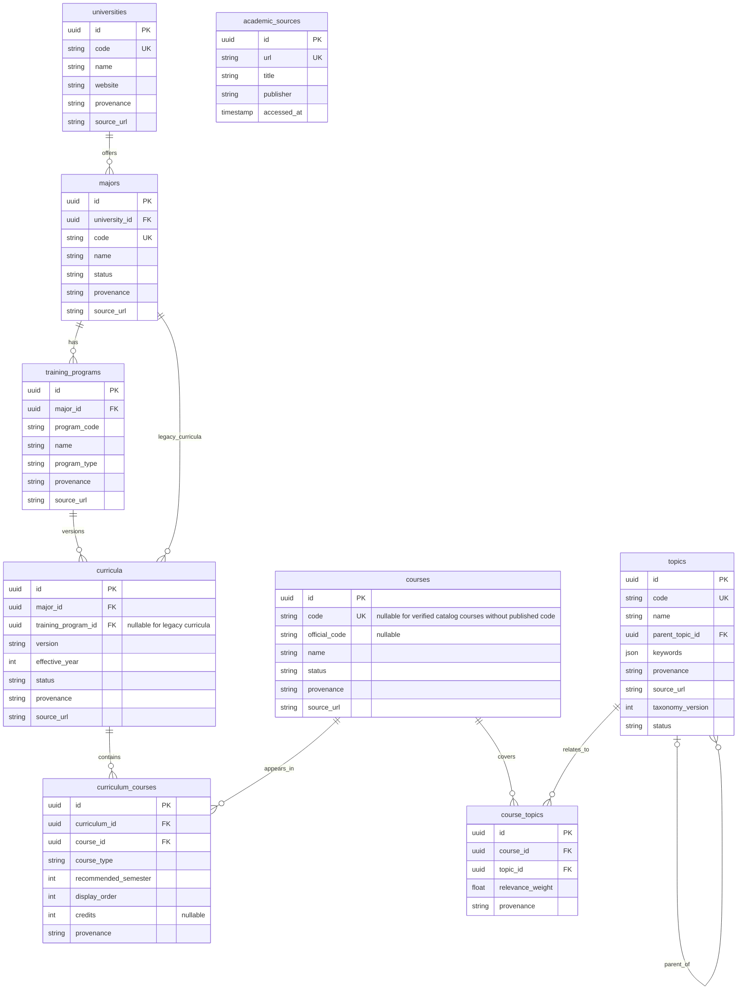

# Academic and Discussion Scope

Teachers participate in questions and answers as ordinary users. The application
does not certify academic correctness or rank the reliability of knowledge.
Acceptance records which answer resolved a question; it does not certify academic
correctness. Post approval is manual and restricted to admins and moderators. AI and reporting
modules are not currently deployed; their schema is retained for future implementation.

## Academic ERD

The academic catalog has nine domain tables. Legacy community sample rows remain
separate from the PTIT catalogue and retain their simulated nature. User accounts
belong to identity-service; rooms and discussions belong to discussion-service.

Curriculum versions are unique within a training program; legacy curricula with
no program remain unique within a major. Other unique pairs are
`(curriculum_id, course_id)` and `(course_id, topic_id)`. Course codes are nullable
so an unpublished code is not invented. Provenance values are `OFFICIAL`,
`DERIVED` and `SIMULATED`; a source URL is stored on catalog rows. The diagram
omits descriptions and timestamps for clarity.

The seed currently uses one current snapshot for IT and curricula explicitly
applied from 2025 for Cybersecurity and Marketing. The IT page does not state an
application year in its title, so its version is named a 2026 access snapshot,
not an official “2026 curriculum”. Course codes are absent from these pages and
remain null. The major pages do not provide separate program/admission codes
for the standard programs; those also remain null. Course-topic outlines and
discussion content are simulated.
No Document/RAG module exists in this repository, so none is fabricated.

## Discussion Decisions

| Feature | Current scope |
| --- | --- |
| Answers and revisions | Retained, including anonymous answers |
| Answer acceptances | Retained with question/answer versions and revocation history |
| Academic staff assignments | Removed |
| Academic answer reviews and disputes | Removed; users discuss corrections in comments |
| Verification state and knowledge tier | Removed |
| Reports, moderation cases and audit logs | Schema retained; module and API not deployed |
| Manual post approval | Admin/moderator queue and allow/hide decisions; review history retained |
| AI moderation and topic suggestions | Schema retained; module and API not deployed |

The question author or an admin may accept an answer. Authors cannot accept their
own answers. Teacher status and room moderator status do not grant acceptance
rights on another user's question. Only approved questions may have an accepted answer. Answers and comments require
no approval. Editing a post requires approval again and revokes acceptance; semantic
edits to the accepted answer revoke acceptance without requiring answer approval.

## Permissions

| Actor | Content management |
| --- | --- |
| Student or teacher | Own content, subject to discussion rules |
| Global moderator or admin | Existing content edit/delete permissions |
| Admin or global moderator | Manual post approval |
| Active room owner or moderator | Room management; moderation queue and comment locking not deployed |
| Expired, muted, banned or pending room membership | No room management authority |

Room roles are assigned through `room_memberships`, independently of the account
role. AI result, topic-feedback, report and comment-locking endpoints are not exposed.
Admins and moderators use `GET /api/moderation/pending` and `PATCH /api/moderation/{type}/{id}`
for discussions only; answer/comment review requests are rejected. The frontend
exposes the queue to admins and moderators. New or edited posts are `pending/held`;
approval changes them to `approved/visible`
and rejection to `hidden/hidden`. Pending or rejected content is visible only to
its author, admins and moderators. Decisions check the content version and text to reject stale
reviews and are recorded in `moderation_reviews` with `related_ai_run_id = NULL`.
AI fields have no effect on manual approval. Answers and comments are immediately
visible in approved posts, even if historical moderation fields were pending. Their
notifications are sent when created. Room privacy and membership policies remain active.

## Migration

No migration is added to remove AI/report/moderation tables or columns. Reserved
entities remain registered with TypeORM so schema synchronization preserves them.

Historical migrations remain unchanged. Earlier migrations remove
`academic_staff_assignments`, `answer_reviews`, `academic_disputes`,
`answers.verification_state` and `answers.knowledge_tier`.
They preserve answers, revisions, acceptances and moderation history.

Both services run migrations at startup. Back up existing databases before
deploying this change: removed verification data is not retained. Migration
rollback restores the old schema only; recovering old data requires the backup.
The TypeORM migrations bookkeeping table is not a domain table in the ERD.

The gateway no longer exposes staff-assignment, answer-review or academic-dispute
routes. Clients must stop sending or reading the removed answer fields. Seed
data uses the reduced schema.
